# Car Rental Project
Written by Java - Spring Boot. 

## Brief
Car Rental Project is a web site for renting a car. This web site consists of a home page, listed cars page, cars details page, login, register
and rent page. Home page is a entry view of site. In this page, users can viewed other customer's most preferred cars, they can obtain information about web site.
Also, they can create an account quickly. Listed cars page where the all cars are listed with pagination. In this page, users can filter cars by specific features.
Such as, car name, empty days, their companies, car types and prices. 
Users can go to the detail page of the car they choose by clicking on it. On the Car Detail Page, all the features of the car are displayed. 

## Technologies and Architecture
N-layered architecture was used as the software architecture of the project. The main layers of the project: Business, Controllers, Data Access, Entity, Core.
In this project, Spring Security, Spring Data Jpa, PostgreSql, Spring Web, Validation, Bootstrap, Lombok and Thymeleaf technologies are used.
Authentication and authorization processes in the security process are provided with JWT. PostgreSql is used as a database. 
For the frontend of project, Thymeleaf is used. 

## UML Class Diagram of Entities

 
	

## Project's UI

### Home Page
#### Users can filter cars by rent and return date.

 
	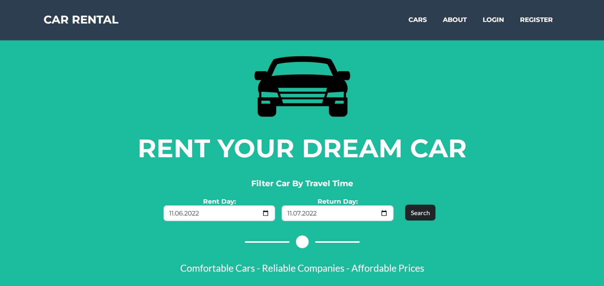
	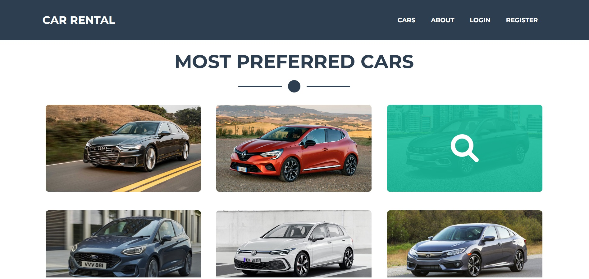
	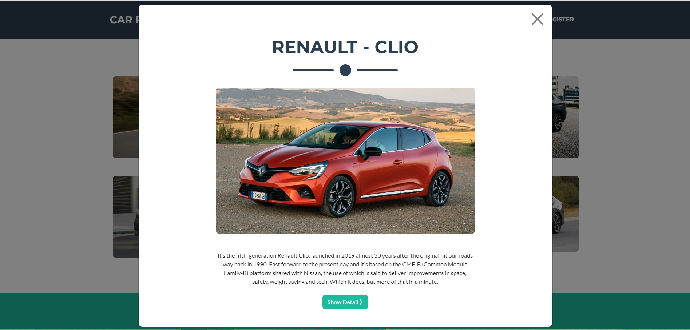

### Car List Page
#### All Cars lists in this page with pagination.

 
	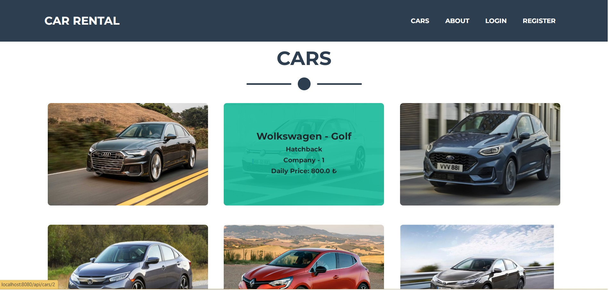

### Car Detail Page
#### Users can go to car detail page by clicking car image.

 
	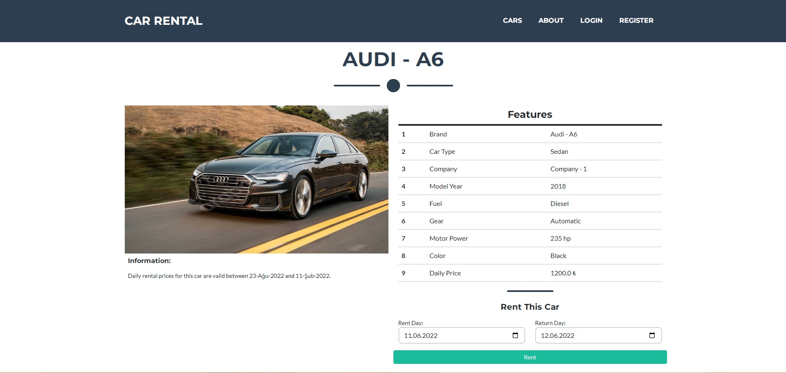
	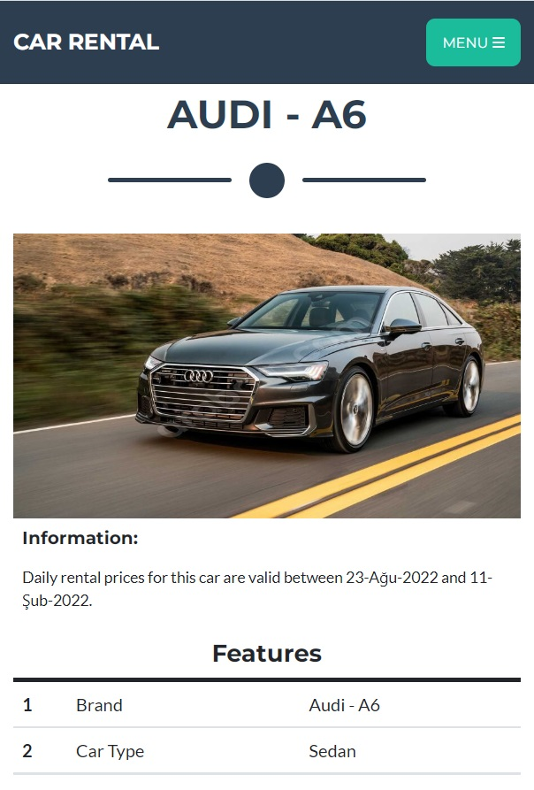

### Registration Page
#### The registration form to create an account is on this page.

 
	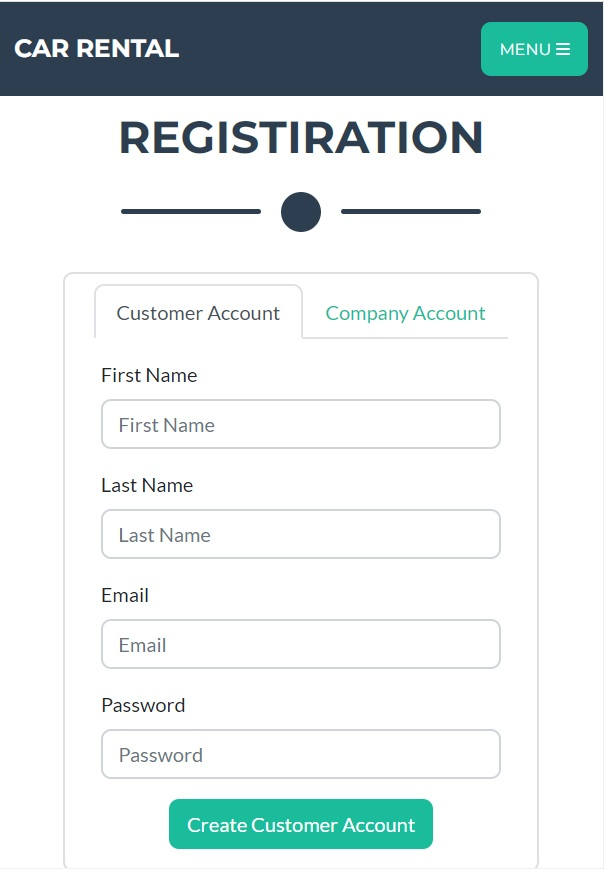

### Payment Messages

 
	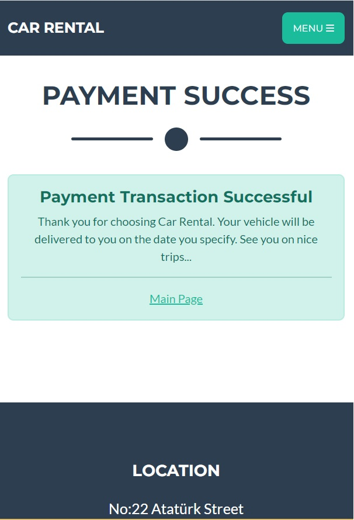
	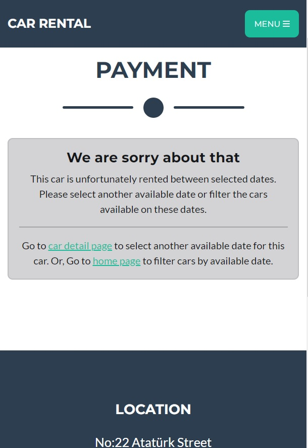

### Responsive Design
#### Project's UI design was created using Bootstrap and Thymeleaf. It has a responsive design for tablets, phones.

 
	
	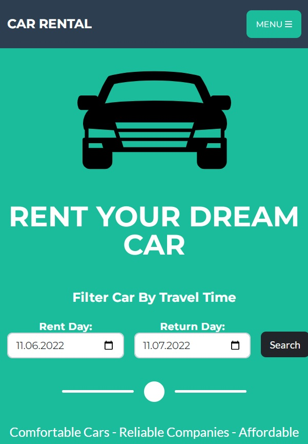

	
	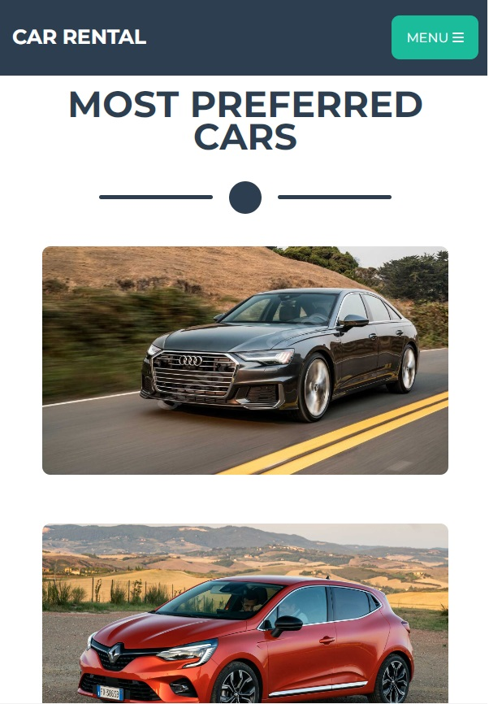

## Layers of Project

### Entity
Entity classes which are represented in database as a table, dtos are in this package.

### Data Access
JpaRepository interfaces for accessing the database and retrieving the values are here.

### Core
Security classes and filters which are necessary for using Spring Security.

### Business
Manager classes and services for business code.

### Api
Project's controllers for api are in this package.

